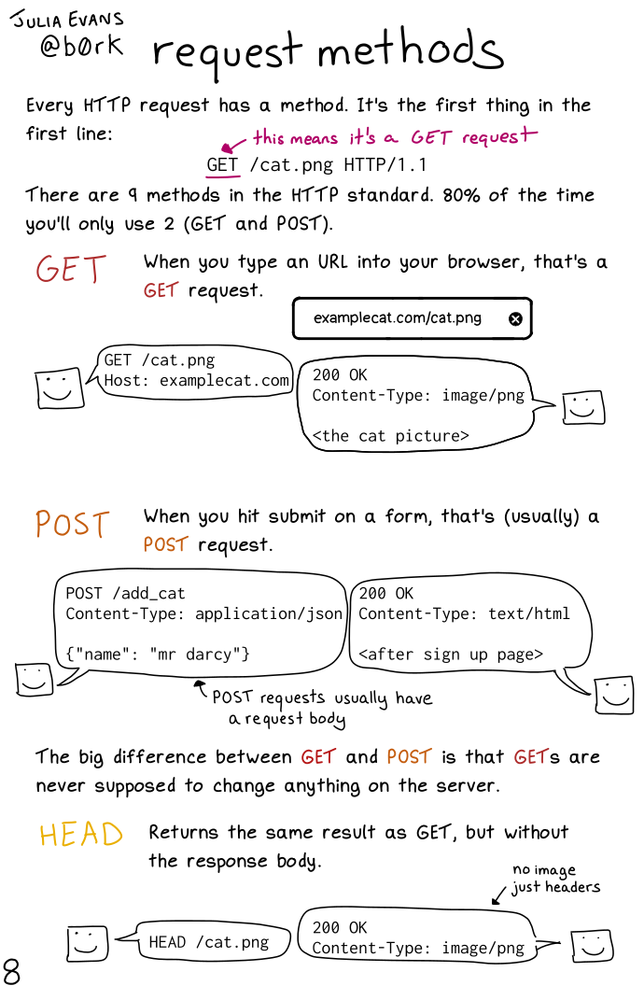
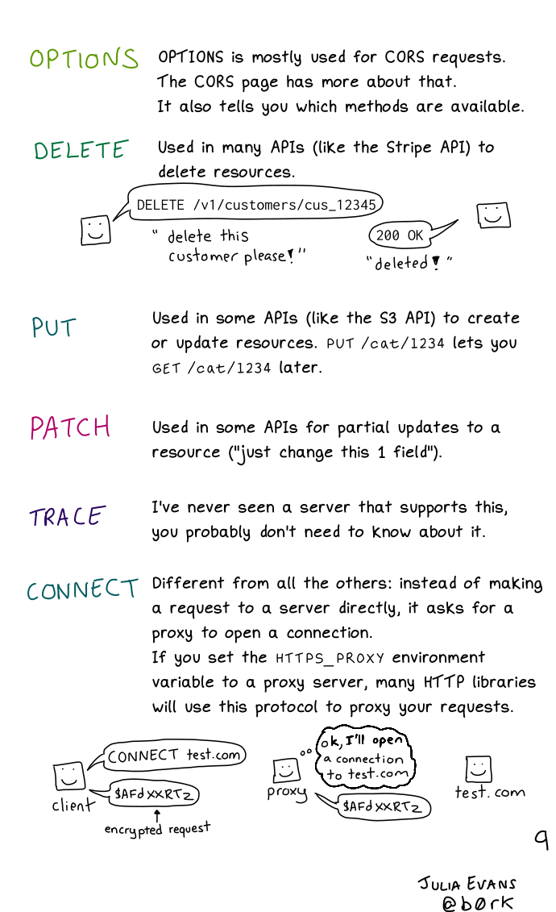

title: NodeJS Course
subtitle: Session 2 - request types
organisation: Hamburg Coding School
class: animation-fade
layout: true

<!-- This is a presentation using backslide to convert the markdown into slides.
     See https://github.com/sinedied/backslide for more details.
     Run backslide as a docker via
     docker run --rm --init -p 4100:4100 -v $PWD:/src registry.gitlab.com/mpolitze/backslide-docker:latest serve -s -p 4100
-->

<!-- This slide will serve as the base layout for all your slides -->

.bottom-bar[
{{title}} -- {{subtitle}} -- {{organisation}}
]
.logo[]

---

class: titlepage

# {{title}}

## {{subtitle}}

---

# When does a request happen?

- Every time some resource is needed
  - initial request to get the HTML page
  - css files
  - images
  - ...

---

# GET

- Most common request type
- Standard type, if no request type is given

Idea:

- Retrieve ("get") data or files
- Does not modify any data

Note:

- Can be cached!

---

# POST

- Post some data to the server
- Usually if you submit a form
- Data is modified

Note:

- Gives a strange message, if you reload the page
- Get-after-post pattern!

---

class: full

.center[.fitHeight[]]

---

class: full

.center[.fitHeight[]]

---

# Thank you

## Tobias Schulz-Hess

[.color1[<i class="fas fa-envelope"></i> tobias@hamburgcodingschool.com]](mailto:tobias@hamburgcodingschool.com)

[.color2[<i class="fab fa-slack"></i> Tobias Schulz-Hess]](https://hamburgcodingschool.slack.com/archives/D026E6LB0PN)

[.color4[<i class="fab fa-twitter"></i> ToBe_HH]](https://twitter.com/ToBe_HH)

.small[Graphics by Julia Evans [<i class="fab fa-twitter"></i> b0rk](https://twitter.com/b0rk)]
